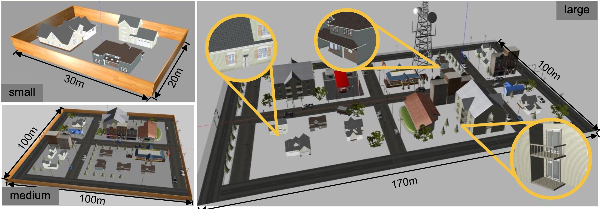

# Openbench: A New Benchmark And Baseline For Semantic Navigation In Smart Logistics


Junhui Wang<sup>1,2</sup>, Dongjie Huo<sup>3</sup>, Zehui Xu<sup>4</sup>, Yongliang Shi<sup>2</sup>, Yimin Yan<sup>2</sup>, Yuanxin Wang<sup>5</sup>, Chao Gao<sup>2,†</sup>, Yan Qiao<sup>1,†</sup>, Guyue Zhou<sup>2</sup>


<sup>1</sup>Institute of Systems Engineering and Collaborative Laboratory for Intelligent Science and Systems, Macau University of Science and Technology  
<sup>2</sup>Institute for AI Industry Research (AIR), Tsinghua University  
<sup>3</sup>College of Information Science and Technology, Beijing University of Chemical Technology  
<sup>4</sup>School of Astronautics, Harbin Institute of Technology  
<sup>5</sup>School of Mechanical and Vehicular Engineering, Beijing Institute of Technology

  
<sup>†</sup>Corresponding authors

[Paper](https://example.com/paper) | [arXiv](https://arxiv.org/abs/xxxx.xxxxx) | [Code (Coming soon)](https://air-discover.github.io/Hint-AD/)


## Abstract

The increasing demand for efficient last-mile delivery in smart logistics underscores the role of autonomous robots in enhancing operational efficiency and reducing costs. Traditional navigation methods, which depend on high-precision maps, are resource-intensive, while learning-based approaches often struggle with generalization in real-world scenarios. To address these challenges, this work proposes the Openstreetmap-enhanced oPen-air sEmantic Navigation (OPEN) system that combines foundation models with classic algorithms for scalable outdoor navigation. The system leverages OpenStreetMap (OSM) for flexible map representation, thereby eliminating the need for extensive pre-mapping efforts. It also employs Large Language Models (LLMs) to comprehend delivery instructions and Vision-Language Models (VLMs) for global localization, map updates, and house number recognition. To compensate the limitations of existing benchmarks that are inadequate for assessing last-mile delivery, this work introduces a new benchmark specifically designed for outdoor navigation in residential areas, reflecting the real-world challenges faced by autonomous delivery systems. Extensive experiments validate the effectiveness of the proposed system in enhancing navigation efficiency and reliability. To facilitate further research, our code and benchmark are publicly available.

## Introduction & Method

 


**Fig. 1:** Overview of the proposed benchmark framework. The diagram presents the simulation environments and corresponding OSM, which are provided for the implementation of semantic navigation systems. This framework necessitates the navigation system to process natural language instructions autonomously, enabling accurate navigation from the initial starting point to the designated customer's front door.

The OPEN system for autonomous last-mile delivery combines foundation models with classic algorithms to enhance semantic navigation. It employs LLMs for natural language understanding and VLMs for global localization, map updates, and house number recognition. This approach ensures reliable GPS-free navigation, improving the system's efficiency, reliability, and long-term performance.

## Dataset


## 

**Fig. 2:** Simulation environment for last-mile delivery.

Based on the gazebo simulation platform, we constructed three distinct world models of varying sizes, categorized into three levels: small, medium, and large, depending on the complexity of their environments. Each building within these models has been labeled with house numbers on their doors. Additionally, corresponding OSMs data are generated for each world model, reflecting real-world situations.


## Results


**Fig. 3:** Overview of the OPEN system for autonomous last-mile delivery. The system initiates with a natural language delivery request, processed by a task planning module powered by an LLM. This module interacts with OSM to extract destination details and generates a structured task sequence. The robot autonomously decides between navigation and exploration modes, generating waypoints for execution by a classical planner.

The proposed OPEN system achieves success rates of 100%, 100%, and 60% in small, medium, and large environments, respectively, significantly outperforming baseline methods. The system demonstrates improved navigation efficiency and reliability in both simulated and real-world experiments.


## BibTeX

```tex
@inproceedings{wangopenbench,
  title={Openbench: A New Benchmark And Baseline For Semantic Navigation In Smart Logistics},
  author={Wang, Junhui and Huo, Dongjie and Xu, Zehui and Shi, Yongliang and Yan, Yimin and Wang, Yuanxin and Gao, Chao and Qiao, Yan and Zhou, Guyue},
  booktitle={ICRA 2025},
  year={2025}
}
```


